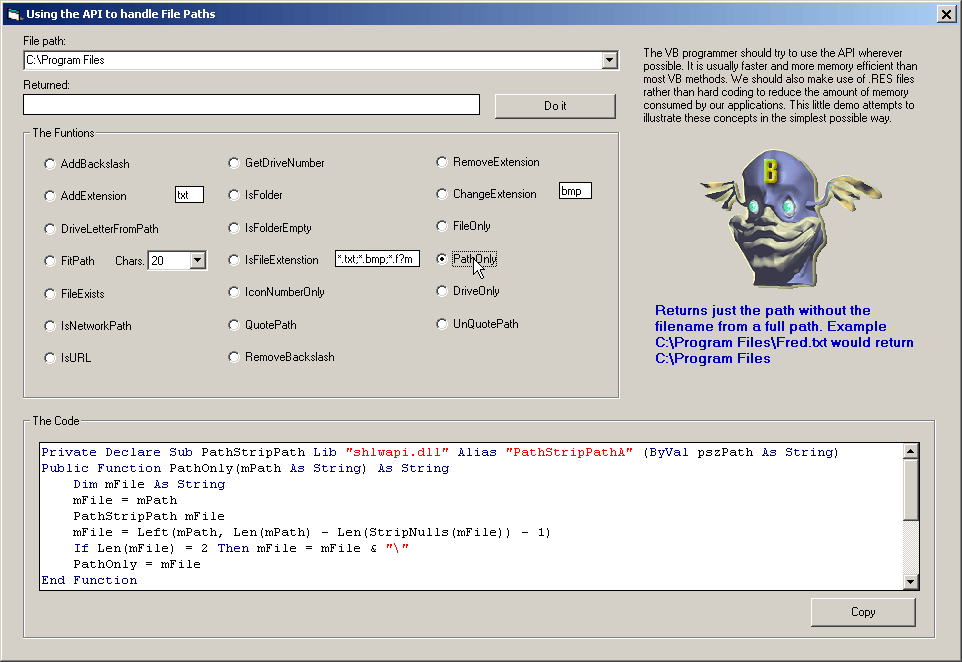



## More API for Beginners

### Description

Handling File Paths. The VB programmer should try to use the API wherever possible. It is usually faster and more memory efficient than most VB methods. We should also make use of .RES files rather than hard coding to reduce the amount of memory consumed by our applications. This little demo attempts to illustrate these concepts in the simplest possible way.
 
### More Info
 

             |
---                |---
**Submitted On**   |2003-11-07 15:46:02
**By**             |[MrBobo](https://github.com/Planet-Source-Code/PSCIndex/blob/master/ByAuthor/mrbobo.md)
**Level**          |Beginner
**User Rating**    |4.7 (28 globes from 6 users)
**Compatibility**  |VB 6\.0
**Category**       |[Windows API Call/ Explanation](https://github.com/Planet-Source-Code/PSCIndex/blob/master/ByCategory/windows-api-call-explanation__1-39.md)
**World**          |[Visual Basic](https://github.com/Planet-Source-Code/PSCIndex/blob/master/ByWorld/visual-basic.md)
**Archive File**   |[More\_API\_f1668991172003\.zip](https://github.com/Planet-Source-Code/mrbobo-more-api-for-beginners__1-49732/archive/master.zip)

